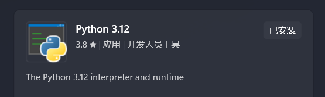
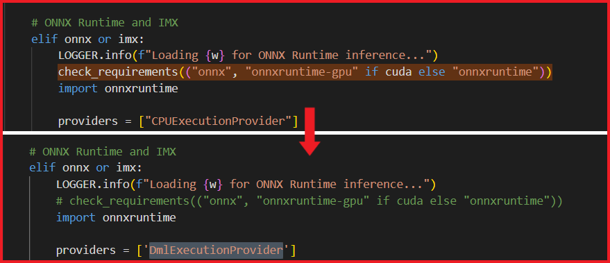
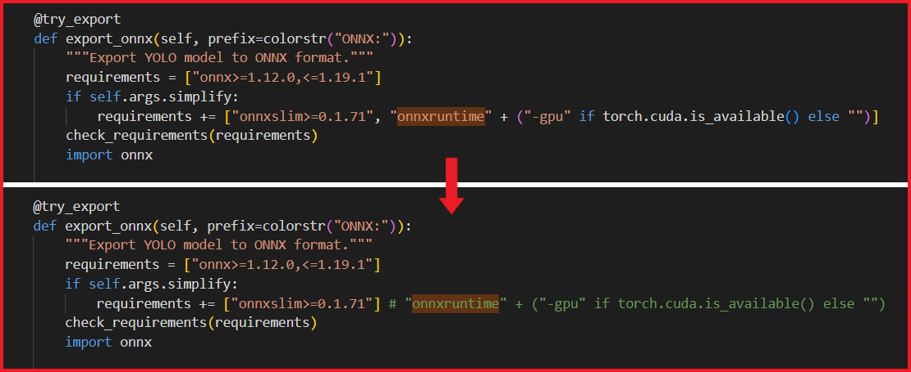

#  HachimiDX-Convert 🐱

**小团体不拉我，拿不到最新最热，所以自己抄谱😡😡😡😭😭😭🤔🤔🤔😋😋😋**

本项目使用 YOLO11+OpenCV 识别音乐游戏 maimai 的谱面确认视频，反向推理出谱面信息，最后导出为 simai 语法的 maidata.txt。

## 基础功能
- 内嵌 MajEdit, MajView

## 已实现的功能
- 支持 tap, slide, touch, hold, touch-hold 全种类音符识别
- 支持 ex-note, break-note, ex-break-note 全子类识别
- 支持 slide, hold, touch-hold 时值的识别
- 支持超大尺寸的 touch, touch-hold 音符识别 (常见于 basic 难度)
- 支持基础的星星轨迹识别 (< > -)

## 当前的局限
- slide:
    - 不支持复杂的星星轨迹
    - 不支持相同起始点的星星 (x*x)
    - 不支持 wifi 星星 (w)
- touch, touch-hold:
    - 不支持在同一个位置重叠出现的 touch, touch-hold
    - 无法识别 touch, touch-hold 的烟花特效 (f)

- 仅支持 2^n 的时间分辨率，以及12分音符
- slide, touch-hold 的时值不太准 (但是 hold 时值比较精准)
- 不支持变化的 BPM (一首歌的 BPM 必须全程不变)
- 如果谱面确认视频是用相机拍屏幕，受到色偏影响，此时 ex-note, break-note, ex-break-note 的识别准确率可能会降低

## 依赖安装 (必须严格按照顺序安装)

**注意：运行本项目推荐使用独立显卡，纯 cpu 或核显处理速度会很慢**

**注意：运行本项目推荐使用独立显卡，纯 cpu 或核显处理速度会很慢**

**注意：运行本项目推荐使用独立显卡，纯 cpu 或核显处理速度会很慢**

### 0. 安装 Python 本体

如果还没有安装过 Python 本体，推荐去微软商店搜索 `Python 3.12` 下载

在 cmd 输入 `python --version`，如果有输出 `Python 3.xx`，代表 Python 已经成功安装了

### 1. 创建 Python 虚拟环境（必需）

- 创建环境 - `python -m venv .venv`
- 激活环境 - `.venv\Scripts\activate`
- 更新依赖 - `python3 -m pip install --upgrade pip`
- 更新依赖 - `python3 -m pip install wheel`

### 2. 安装 PyTorch

根据硬件选择对应的安装指令：

1. 如果使用 `Nvidia` 显卡 (≥ GTX 900)：
    - 在 cmd 输入 `nvidia-smi` 查看 cuda 版本
    - 到 [PyTorch官网](https://pytorch.org/get-started/locally/) 选择对应 cuda 版本的安装命令

2. 如果使用其他硬件：
    - 到 [PyTorch官网](https://pytorch.org/get-started/locally/) 选择 cpu 版本的安装命令

选择对应的安装命令后，在 Python 虚拟环境中输入以安装 PyTorch

### 3. 安装 Ultralytics

`pip install ultralytics`

### 4. 安装额外的模型推理后端

根据硬件不同选择对应的后端:

1. 如果使用 `Nvidia` 显卡 (≥ GTX 900)：
    - 安装 tensorRT - `pip install --no-cache-dir tensorrt==10.13.2.6`
    - 2025.11.05 [issue](https://github.com/NVIDIA/tensorrt/issues/4614)：当前新版 10.13.3.9 无法安装，回退到上一版

2. 如果使用其他硬件：
    - 安装 onnx-directml - `pip install onnx onnxruntime-directml`
    - 2025.11.11 [issue](https://github.com/ultralytics/yolov5/issues/2995)：当前 ultralytics 库原生不支持 DirectML 后端，需要修改源码
        - 修改 `.venv\Lib\site-packages\ultralytics\nn\autobackend.py`

        
    
        - 修改 `.venv\Lib\site-packages\ultralytics\engine\exporter.py`

        

### 5. 安装其他的库

`pip install PyQt6 pywin32 librosa soundfile pydantic`
